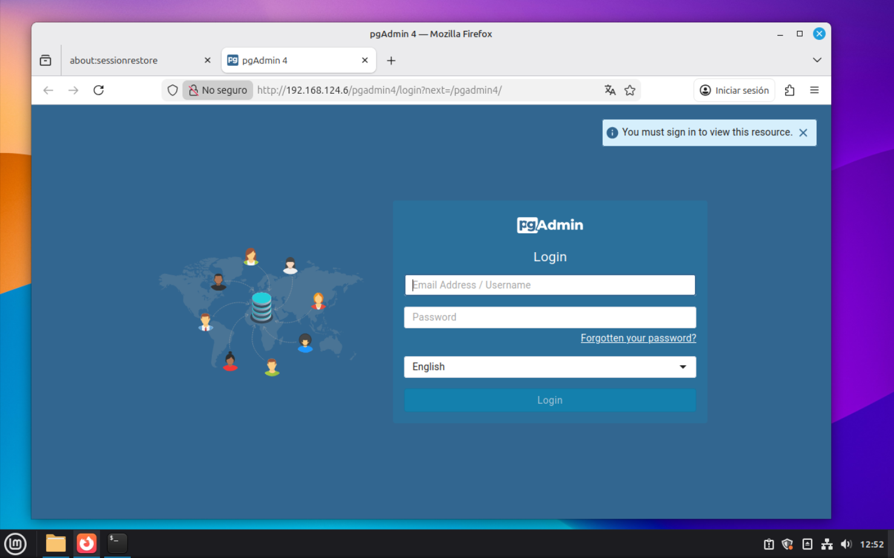
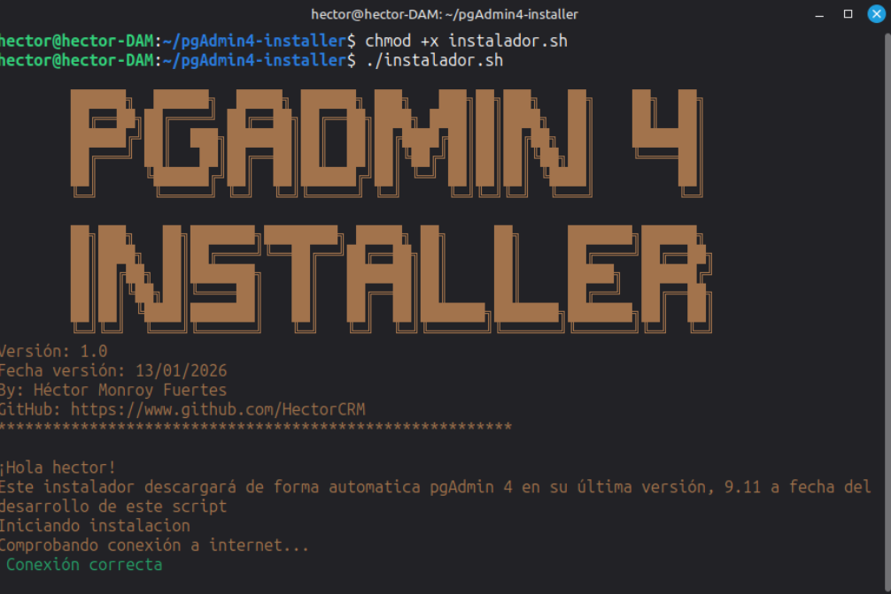
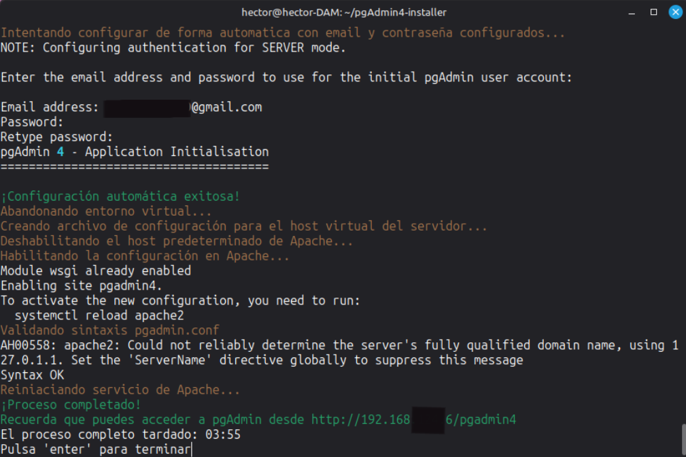

# pgAdmin4-easy-installer   


[](https://github.com/MShawon/github-clone-count-badge)  


<details>
  <summary><b>Índice</b></summary>
  <ol>
    <li><a href="#antes-de-usar">Antes de usar</a></li>
    <li><a href="#utilidad-proyecto">Utilidad del proyecto</a></li>
    <li><a href="#instalacion">Guia de instalación</a></li>
    <li><a href="#requisitos">Requisitos para uso</a></li>
    <li><a href="#mejoras">Mejoras futuras</a></li>
    <li><a href="#distribuciones-linux-en-las-que-se-ha-probado">Distribuciones probadas</a></li>
    <li><a href="#versiones">Historial de versiones</a></li>
  </ol>
</details>

<a name="antes-de-usar"></a>
## Antes de usar  ⚠️
Por el momento este instalador sólo ha sido probado en VM con Linux Mint 22.2, para un uso educativo.  

<a name="utilidad-proyecto"></a>
## ¿Cual es la utilidad de este proyecto? ⁉️
Si has tratado de instalar y configurar alguna vez pgAdmin 4 en modo servidor, seguro que sabes lo complicado que puede llegar a ser las primeras veces. De hecho si has llegado hasta este proyecto seguramente haya sido por que ya no sabías donde rebuscar para lograrlo.  
Este pequeño proyecto trata de simplificar al máximo la instalación y configuración de pgAdmin 4 en su última versión, 9.11 (a fecha 13/01/2026). De hecho se **instala y configura en 4 minutos**. Lo único que tiene que hacer el usuario es ejecutarlo y aportar un email y contraseña para acceder a pgAdmin cuando el instalador lo solicite. Y ya está. En 4 minutos estarás ante la pantalla de acceso a pgAdmin:  
  

<a name="instalacion"></a>
## Instalación  :gear:
Clona este repositorio:  
```
git clone https://github.com/HectorCRM/pgAdmin4-easy-installer.git
```
Dale permiso de ejecución al archivo ***pgAdmin4-install.sh***:  
```
chmod +x pgAdmin4-install.sh
```
Ejecútalo:  
```
./pgAdmin4-install.sh
```
  
Esto es lo que el instalador va haciendo automaticamente:  
**#1.** El instalador comprobará la conexión a internet lanzando un ping a github.com.  
**#2.** Actualizará los repositorios del sistema.  
**#3.** Después instalara algunas dependencias necesarias para pgAdmin y Apache.  
**#4.** Creará los directorios necesarios para el correcto funcionamiento de pgAdmin y del servidor.  
**#5.** Creará un entorno virtual con python-venv.  
**#6.** Descargará e instalará pgAdmin desde la página oficial. Para esta versión del instalador descargará la versión 9.11.  
**#7.** Creará el archivo de configuración local **config_local.py**.  
**#8.** Ahora pedirá al usuario un email y una contraseña para acceder a pgAdmin desde el navegador.  
**#9.** Después creará un archivo de configuracion para el servidor de Apache. Deshabilitará el host predeterminado de Apache y habilitará el que se acaba de crear.  
**#10.** Comprueba la correción de la sintaxis del archivo creado y reinicia el servicio de Apache para que inicie con la nueva configuración.  
**#11.** Finaliza la instalación y abre pgAdmin4 en Firefox. Si no se tiene instalado Firefox muestra la ruta para copiar y pegar en el navegador.  
  
Y al fin, tras algo menos de 4 minutos...  
  


<a name="requisitos"></a>
## Requisitos :clipboard:
 - [Ver distribuciones de Linux soportadas](#distribuciones-linux-en-las-que-se-ha-probado)  
 - Conexión a internet  

<a name="mejoras"></a> 
## Mejoras futuras :rocket:
 - Desarrollar desinstalador.  
 - Implementar el uso de banderas.  
 - Probar en Ubuntu 24.04.  
 - Probar en Debian.  
 - Desarrollar variante para otras distribuciones Linux.  

<a name="distribuciones-linux-en-las-que-se-ha-probado"></a> 
## Distribuciones Linux en las que se ha probado :heavy_check_mark:
 - :heavy_check_mark:Linux Mint 22.2 .  


<a name="versiones"></a>
## Versiones :pushpin:
[Ver CHANGELOG.md](./CHANGELOG.md)
